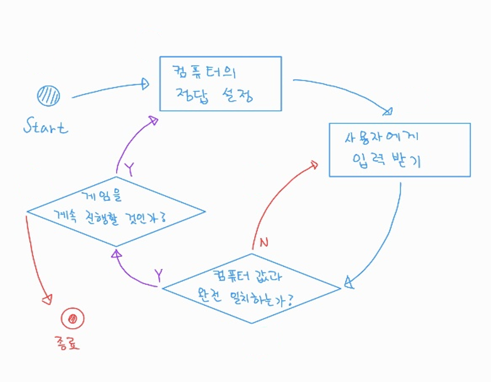

# 숫자 야구 게임

## 1. 프로세스

## 2. 기능 목록

|No|기능 정의|비고|
|:---:|:---|:---|
|1|게임 시작|
|2|1 ~ 9 사이의 숫자 3개 가져오기|대상 : 컴퓨터 정답 설정|
|3|사용자로부터 3자리 숫자 입력받기|
|4|사용자 입력이 모두 숫자인지 확인하기|
|5|사용자 입력이 모두 숫자가 아닌 경우 에러메시지 출력|3번 기능부터 다시 동작|
|6|3자리 숫자 중 중복되는 숫자가 있는지 확인하기|대상 : 컴퓨터 정답, 사용자 입력|
|7|사용자의 숫자가 컴퓨터의 숫자 중 하나라도 존재하는지 확인|True인 경우 8번 기능 실행 False인 경우 3번 기능부터 다시 동작|
|8|사용자의 숫자가 하나 이상 존재할 때, 스트라이크와 볼의 갯수 확인하기|
|9|스트라이크, 볼 갯수 출력|스트라이크의 수가 3보다 작은 경우 3번 기능부터 다시 동작|
|10|스트라이크의 수가 3인 경우 게임 종료|
|11|게임 재시작 여부 확인 메시지 출력|게임을 재시작할 경우 1번 기능부터 다시 동작|
|12|게임 종료|